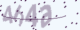

### This is the python version of captcha recognition implemented by MXNet. 

It is modified from [reference1:xlvector](https://github.com/xlvector/learning-dl/blob/master/mxnet/ocr/cnn_ocr.py). There is also a R version of captcha recognition of MXNet [reference2:incubator-mxnet](https://github.com/apache/incubator-mxnet/tree/master/example/captcha). **However the main difference is this version can recognize a captcha composed of number or lowercase letters or capital**. For example:

### Usage

clone this project and just run:

`python captcha_train.py`

### Attention

* The result of model is sensitive to `learning rate` and is a little difficult to converge. 
